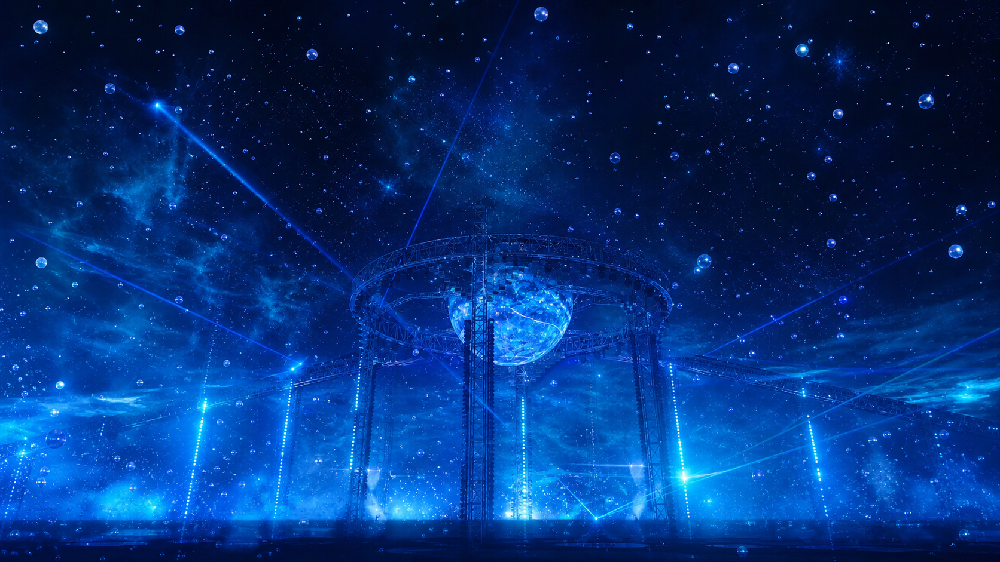

<div align="center">

<h1>风之海 · 沉浸互动体验</h1>

<p><strong>在蓝色风与海之间，梦回演唱会现场。</strong></p>

<p>
用双手、鼠标或手机触碰泡泡、拿起风车、拉开云海，<br>
再做出华晨宇火星手势，让一颗爱心在掌心之间亮起。
</p>

<p>
  <a href="https://xiezhengru68-gif.github.io/wind-sea-interactive/"></a>
  <a href="https://github.com/xiezhengru68-gif/wind-sea-interactive/stargazers"></a>
  <a href="https://github.com/xiezhengru68-gif"></a>
  <a href="./LICENSE"></a>
</p>

</div>



## 在线体验

无需安装软件，也不需要 ChatGPT 或 GPT 会员：

### [点击进入《风之海》沉浸互动现场](https://xiezhengru68-gif.github.io/wind-sea-interactive/)

电脑和手机均可打开。建议使用最新版 Chrome、Edge 或 Safari，并允许摄像头权限，以体验完整的双手互动。

## 关于这个项目

这是一个开源、非商业的粉丝向 Web 互动艺术项目。它希望把风、海、星光、蓝色泡泡与舞台空间组合在一起，让屏幕不再只是一张画面，而是一个可以伸手进入的现场。

你可以听着自己有权使用的本地音乐，在多层景深、灯光和粒子环绕中转动视角；也可以开启摄像头，让双手真正进入画面。泡泡会破裂，烟雾会飘散，风车可以被拿起，手势会改变云层——在属于自己的几分钟里，梦回演唱会现场，身临其境地感受《风之海》的温柔与辽阔。


## 互动亮点

| 互动 | 怎么玩 | 画面反馈 |
| --- | --- | --- |
| 🫶 华晨宇火星手势 | 开启摄像头，让双手的拇指相接、食指相接，并保持约半秒 | 两手中间亮起蓝粉色爱心，小爱心向上飘散，并带有轻微震动反馈 |
| 💙 蓝色风车 | 在风车附近捏合手指；也可以用鼠标或触摸按住拖动 | 风车被拿到手中，移动越快旋转越快；松开后顺势放飞 |
| 🫧 烟雾泡泡 | 点击、触摸，或在泡泡附近捏合手指 | 泡泡破裂，内部白色烟雾自然散开 |
| ☁️ 双手云海 | 双手拉开，改变两只手掌之间的距离 | 云带在两手之间延展；合拢后压成一颗软糯回弹的泡泡 |
| 🌊 3D 空间环绕 | 移动鼠标、滑动屏幕，或转动手机 | 舞台、星光、泡泡与海面产生不同层级的空间视差 |
| 🎵 音乐响应 | 点击“本地音乐”，选择自己有权使用的音频 | 灯光、泡泡与环境能量跟随音乐变化 |

> 火星手势识别到后会优先显示爱心，云带会暂时让位，避免两种效果叠在一起。

## 推荐体验方式

1. 打开在线体验，点击“开始体验”。
2. 点击“本地音乐”，选择设备中自己有权使用的音频文件。
3. 打开“3D 环绕”，移动视角或轻轻转动手机。
4. 点击“伸手触碰”，允许浏览器使用摄像头。
5. 让双手完整出现在画面中，尝试火星手势、拉云、捏泡泡和拿起蓝色风车。

为了让手势更容易被识别，请尽量保持光线明亮、手掌正对摄像头，并让两只手都完整入镜。

## 隐私与音乐

- 摄像头画面与手势识别都在当前设备中处理，不会上传到服务器。
- 关闭摄像头功能或离开页面后，摄像头轨道会被停止。
- 项目不附带商业歌曲、完整歌词或现场视频。
- 本地选择的音频只在当前浏览器中播放，不会上传。
- 请仅导入自己拥有或已经获得授权的音频。

## 技术实现

- [Next.js](https://nextjs.org/) + React + TypeScript
- [MediaPipe Hand Landmarker](https://ai.google.dev/edge/mediapipe/solutions/vision/hand_landmarker) 双手关键点识别
- Canvas 2D 实时泡泡、烟雾、云带、爱心与风车粒子
- Web Audio API 音乐能量分析
- Device Orientation 手机空间视差
- GitHub Actions + GitHub Pages 自动发布

## 本地运行

需要 Node.js 22.13 或更高版本，以及 pnpm。

```bash
git clone https://github.com/xiezhengru68-gif/wind-sea-interactive.git
cd wind-sea-interactive
pnpm install
pnpm dev
```

然后打开 <http://localhost:3000>。

生产构建：

```bash
pnpm build
```

## 部署

推送到 `main` 分支后，仓库中的 GitHub Actions 会自动构建并发布到 GitHub Pages。

如果你 Fork 这个项目，需要在仓库的 **Settings → Pages** 中选择 **GitHub Actions** 作为发布来源，并根据自己的仓库名调整 `NEXT_PUBLIC_BASE_PATH`。

## 开源与版权说明

这是非官方、非商业的粉丝向互动艺术项目，与华晨宇本人、唱片公司、演出主办方或其他权利方不存在隶属、代言或授权关系。

项目不包含《风之海》的歌曲音频、完整歌词、现场视频或演唱会舞台原图。音乐、艺人姓名及相关内容的权利归各自权利人所有。项目中的互动场景与配图为原创或重新设计的视觉表达，不用于冒充官方内容。

代码以 [MIT License](LICENSE) 开源。使用者仍需自行确认所导入音乐、二次发布内容及使用场景的授权情况。

## 支持这个项目

如果你喜欢这片蓝色的风与海：

- 点亮右上角的 **Star ⭐**，让更多人看到它；
- [Follow @xiezhengru68-gif](https://github.com/xiezhengru68-gif)，关注之后的互动创作；
- 欢迎 Fork、体验、分享想法，也欢迎提交 Issue 或 Pull Request。

<div align="center">

<p><strong>愿每一次伸手，都能碰到属于自己的风与海。</strong></p>

<p>
  <a href="https://xiezhengru68-gif.github.io/wind-sea-interactive/">在线体验</a> ·
  <a href="https://github.com/xiezhengru68-gif/wind-sea-interactive/stargazers">点个 Star</a> ·
  <a href="https://github.com/xiezhengru68-gif">Follow</a>
</p>

</div>
